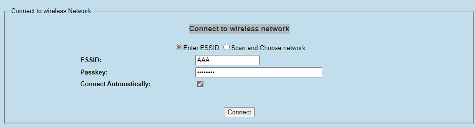

# FX7500/9600 でWi-Fi通信をする方法

FX の設置場所によってはEthernetケーブルの取り回しが難しく、Wi-Fiで通信したいときがあります。よくわかります。

本スレッドはそんな方向けにFXにてWi-Fi通信をするための指南書となっています。

#### 「重要」

**Wi-Fiドングルはメーカーや型番によって、特性や通信パフォーマンスが異なるため、実運用で用いる場合は検証をした上で利用可否をご判断ください。**

 

## Step 1. - Wi-Fiドングルの準備

1. Wi-Fi ドングル（Wi-Fi)を入手する。

    Zebra純正のドングルは無いため、市販のドングルを入手する。サポートされているドングル下記リンクを参照。

    [Supported Wi-Fi Dongles for FX Series of Fixed RFID Readers](https://supportcommunity.zebra.com/s/article/FX7500-SUPPORTED-WI-FI-DONGLES?language=en_US)

    本スレッドでは、サポート対象機器"TL-WN722N"の後継機である、TL-WN725N(JP)を利用。ChipsetはRTL8188E。市場価格は2000円ぐらい。（2023/08/15現在）

    [TP-Link TL-WN725N](https://www.tp-link.com/jp/home-networking/adapter/tl-wn725n/)

## Step 2. - FXの準備

1. ドングルをFXに装着し、FXを起動する。

* 本スレッドではFX7500を例に説明

## Step 3. - FXの設定

1. Admin console > Communicaton > Wireless に移動。
2. Wi-Fiの設定をする。

    

1. FXを再起動。

## Step 4. - 接続確認

1. Admin console > Communicaton > Wireless に移動。
1．Get Details を選択し、接続状況を確認。

    

1. ホストから接続確認。

        C:\Users\xxxxxx>ping 192.168.4.61

        192.168.4.61 に ping を送信しています 32 バイトのデータ:
        192.168.4.61 からの応答: バイト数 =32 時間 =268ms TTL=64
        192.168.4.61 からの応答: バイト数 =32 時間 =184ms TTL=64
        192.168.4.61 からの応答: バイト数 =32 時間 =12ms TTL=64
        192.168.4.61 からの応答: バイト数 =32 時間 =96ms TTL=64

        C:\Users\xxxxxx>ssh 192.168.4.61 -l rfidadm
        rfidadm@FX7500065385:~$
        rfidadm@FX7500065385:~$ who -a
        runlevel        ~               ?       Aug 16 15:02:46
        reboot          ~               ?       Aug 16 15:02:46
        admin           pts/0           00:04   Aug 16 15:36:45  192.168.4.60
        rfidadm         pts/1           00:00   Aug 16 15:39:19  192.168.4.60
        rfidadm@FX7500065385:~$

2. 認識しない場合は System Log や/var/log を確認すること

#### [ガイド終了]